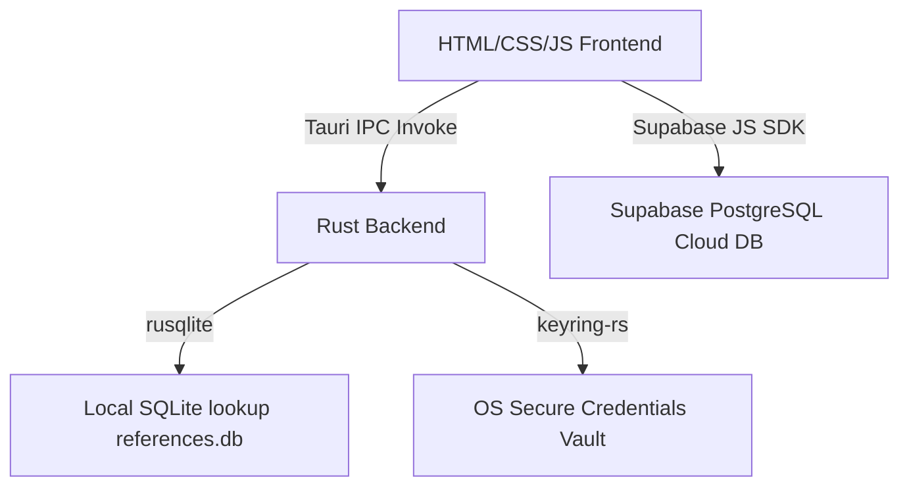

# Monolith - Rust & Tauri Reference Manager

Monolith is a high-performance, premium desktop reference management application built with **Tauri**, **Rust**, and a web frontend (**HTML5/Vanilla CSS/JavaScript**). It provides an automated, hierarchical naming and classification convention system for Projects, Resources, and Documents.

---

## 🏗️ Architecture Overview

The system operates on a hybrid desktop-cloud architecture:



### 1. Front-end Layer (`src/`)
- **UI Structure**: Designed using modern semantic HTML5 with custom searchable combobox controls.
- **Styling**: Premium custom CSS utilizing dynamic layouts, custom properties (variables), transition curves, and CSS Grid.
- **State Management**: Form backtracking logic is preserved in session memory, maintaining user inputs when stepping backward.

### 2. Desktop Backend (`src-tauri/`)
- **Rust Core**: Manages native shell actions, cryptographic hashes, and scale-factor-aware window resizing/positioning.
- **SQLite Database**: Uses a read-only database (`references.db`) packaged as a resource inside the app for high-speed local validation lists (e.g. country codes, document categories).
- **Secure Vault Integration**: Hooks into the native OS keyring (Keychain on macOS, Credential Manager on Windows) using the Rust `keyring` crate to store login credentials.

### 3. Cloud Synchronization (`Supabase`)
- Records generated by the application are synchronized dynamically with a Supabase PostgreSQL instance under the `records` table.
- Falls back gracefully to in-memory caching if offline.

---

## 📋 Database Schemas

### 1. Supabase Cloud Table (`records`)
The remote reference database schema in Supabase stores the generated entities:
- `ref_number` (text, primary key) - Generated unique hierarchical reference.
- `type` (text) - Can be `Project`, `Resource`, or `Document`.
- `name_title` (text) - Entity name in plain text.
- `description` (text) - Description inputted during generation.
- `country` (text) - Origin country.
- `added_by` (text) - User email who created the record.
- `date_added` (timestamp) - Timestamp of generation.

### 2. Local SQLite Reference Tables (`references.db`)
Read-only lookup tables bundled inside `src-tauri/resources/references.db`:
- `countries`: Code and localized labels for origin countries.
- `sectors`: Specific industry sectors.
- `document_categories`: Codes and labels for document classifications.
- `file_types`: Static file formats.

---

## 🚀 Development & Compilation

### Prerequisites
- Node.js (v18+)
- Rust & Cargo Toolchain
- macOS SDK / Xcode Command Line Tools (on macOS)

### Run in Development Mode
To start the live-reload development server:
```bash
cd Monolith_Rust
npm install
npm run dev
```

### Build Production Bundle
To package the app into a native platform executable (e.g. `.dmg` or `.app` on macOS, `.msi` or `.exe` on Windows):
```bash
npm run build
```

---

## 🧹 Database Administration (Cleanup Script)

A utility script `clear_db.js` is provided in the repository to purge all generated reference entries from the cloud database without modifying any authentication tables.

To run the clear-up script:
1. Ensure your `.env` file contains valid `SUPABASE_URL` and `SUPABASE_KEY_OLD` keys.
2. Run the script using Node.js:
   ```bash
   node ../.gemini/antigravity-ide/scratch/clear_db.js
   ```

---

## 🔍 Codebase Audit

A comprehensive codebase audit was performed on the Monolith_Rust application. Below is a summary of the architectural design, security mechanisms, strengths, and recommendations.

### 1. Key Component Deep-Dive

*   **Defensive UI Layout System**: Sizing is constrained to a fixed client viewport of `650px` width and `500px` height. Elements use a robust flex container layout (`flex: 1; min-height: 0;` on `.subview` and inner panels) to guarantee consistent layout stretching in WebView engines. All action buttons are consistently padded exactly `40px` from the bottom edge.
*   **Secure Credentials Storage**: Hooks directly into the OS-native keychain (macOS Keychain, Windows Credential Manager, Linux Secret Service) via the Rust `keyring` crate. User passwords/keys are never written to disk in plain text.
*   **User Hint Cache**: The "Remember Me" credentials hint is stored in a JSON file at `~/.monolith_user_hint.json`.
*   **Lookup Engine (SQLite)**: Bundled local database `references.db` is queried for validation codes. The Rust backend uses `PRAGMA table_info` to adapt queries dynamically based on the schema's available columns (e.g. dynamically checking for a `description` column).
*   **Case Formatting (`to_snake_case`)**: Despite its name, this Rust command formats strings to `Pascal_Snake_Case` (e.g., `"digital banking"` -> `"Digital_Banking"`) by capitalizing words and joining them with underscores.

### 2. Key Strengths
*   **Lightweight WebView Architecture**: Does not require heavy bundlers (Webpack, Vite) during execution, keeping startup load times virtually instant.
*   **Robust Offline Mock Fallback**: Smooth transition into mock mode when database servers or internet access are unavailable.

---

## 💡 Recommendations for Improvement

Here are key architectural and design improvements recommended for the Monolith_Rust codebase:

1.  **Eliminate Hardcoded Fallback Secrets**:
    *   *Issue*: The production Supabase URL and anonymous token key are hardcoded in the Rust code as fallbacks ([main.rs:L258-L263](file:///Users/george/Work/Code/Monolith/Monolith_Rust/src-tauri/src/main.rs#L258-L263)).
    *   *Improvement*: Remove hardcoded secrets and read them exclusively from environment variables or a secure configuration file at runtime/build-time.
2.  **Optimize Supabase Authenticated Fetching**:
    *   *Issue*: The database records cache load starts at window load before the user is authenticated, resulting in blocked Supabase read requests.
    *   *Improvement*: Defer the initial Supabase sync until after a successful login in `main.js`.
3.  **Add Keyring Driver Fallback**:
    *   *Issue*: The `keyring` library will fail if the system keychain daemon is missing or locked (e.g., in a virtualized container, terminal execution, or headless environment).
    *   *Improvement*: Catch keyring initialization errors gracefully and fallback to an encrypted local file store if the OS vault is unavailable.
4.  **Rename `to_snake_case` Command**:
    *   *Issue*: The command name is misleading because it generates `Pascal_Snake_Case`.
    *   *Improvement*: Rename the Tauri command and the JavaScript bindings to `to_pascal_snake_case` to prevent future development layout confusion.

