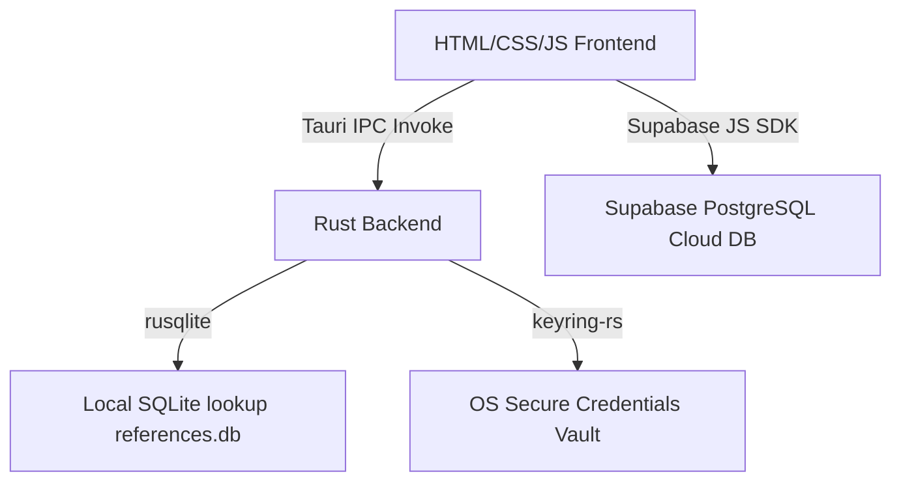

# Monolith - Rust & Tauri Reference Manager

Monolith is a high-performance, premium desktop reference management application built with **Tauri**, **Rust**, and a web frontend (**HTML5/Vanilla CSS/JavaScript**). It provides an automated, hierarchical naming and classification convention system for Projects, Resources, and Documents.

---

## 🏗️ Architecture Overview

The system operates on a hybrid desktop-cloud architecture:



### 1. Front-end Layer (`src/`)
- **UI Structure**: Designed using modern semantic HTML5 with custom searchable combobox controls.
- **Styling**: Premium custom CSS utilizing dynamic layouts, custom properties (variables), transition curves, and CSS Grid.
- **State Management**: Form backtracking logic is preserved in session memory, maintaining user inputs when stepping backward.

### 2. Desktop Backend (`src-tauri/`)
- **Rust Core**: Manages native shell actions, cryptographic hashes, and scale-factor-aware window resizing/positioning.
- **SQLite Database**: Uses a read-only database (`references.db`) packaged as a resource inside the app for high-speed local validation lists (e.g. country codes, document categories).
- **Secure Vault Integration**: Hooks into the native OS keyring (Keychain on macOS, Credential Manager on Windows) using the Rust `keyring` crate to store login credentials.

### 3. Cloud Synchronization (`Supabase`)
- Records generated by the application are synchronized dynamically with a Supabase PostgreSQL instance under the `records` table.
- Falls back gracefully to in-memory caching if offline.

---

## 📋 Database Schemas

### 1. Supabase Cloud Table (`records`)
The remote reference database schema in Supabase stores the generated entities:
- `ref_number` (text, primary key) - Generated unique hierarchical reference.
- `type` (text) - Can be `Project`, `Resource`, or `Document`.
- `name_title` (text) - Entity name in plain text.
- `description` (text) - Description inputted during generation.
- `country` (text) - Origin country.
- `added_by` (text) - User email who created the record.
- `date_added` (timestamp) - Timestamp of generation.

### 2. Local SQLite Reference Tables (`references.db`)
Read-only lookup tables bundled inside `src-tauri/resources/references.db`:
- `countries`: Code and localized labels for origin countries.
- `sectors`: Specific industry sectors.
- `document_categories`: Codes and labels for document classifications.
- `file_types`: Static file formats.

---

## 🚀 Development & Compilation

### Prerequisites
- Node.js (v18+)
- Rust & Cargo Toolchain
- macOS SDK / Xcode Command Line Tools (on macOS)

### Run in Development Mode
To start the live-reload development server:
```bash
cd Monolith_Rust
npm install
npm run dev
```

### Build Production Bundle
To package the app into a native platform executable (e.g. `.dmg` or `.app` on macOS, `.msi` or `.exe` on Windows):
```bash
npm run build
```

---

## 🧹 Database Administration (Cleanup Script)

A utility script `clear_db.js` is provided in the repository to purge all generated reference entries from the cloud database without modifying any authentication tables.

To run the clear-up script:
1. Ensure your `.env` file contains valid `SUPABASE_URL` and `SUPABASE_KEY_OLD` keys.
2. Run the script using Node.js:
   ```bash
   node ../.gemini/antigravity-ide/scratch/clear_db.js
   ```
